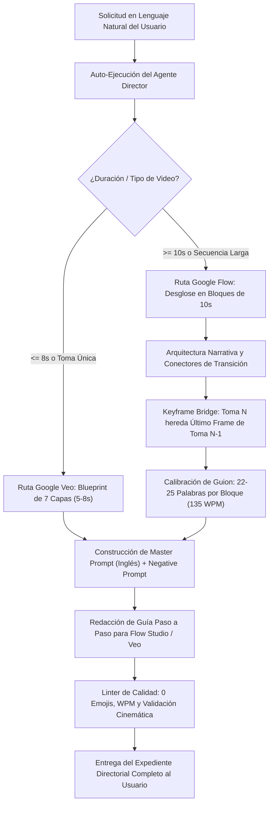

# Google Flow & Veo Autonomous Director Suite

> **Suite y Agente de Dirección Cinematográfica para Google Veo (Veo 2 / 3 / 3.1) y Google Flow Studio.**  
> Desarrollado para concebir, redactar, sincronizar, estructurar y auditar producciones audiovisuales corporativas de alta gama. Traduce solicitudes en lenguaje natural directamente a expedientes de rodaje completos con control milimétrico de cámara, iluminación volumétrica, audio nativo, guiones de locución sincronizados al segundo (135 WPM) y encadenamiento continuo de videos largos sin mutaciones mediante el protocolo **Keyframe Bridge**.

---

## 1. El Agente Director Autónomo y sus Bondades

El corazón de la suite v1.1.0 es el **Agente Director Autónomo (`FlowVeoDirectorAgent`)**. Este agente se activa automáticamente tanto en entornos de IA (Antigravity, Codex, Claude Code) como desde la línea de comandos (`flow-veo agent`), permitiendo a cualquier creador o empresa exprimir el 100% de la capacidad de Google Veo y Google Flow Studio a partir de una simple frase en lenguaje natural.

```
+---------------------------------------------------------------------------------------------------+
|                        GOOGLE FLOW & VEO AUTONOMOUS DIRECTOR AGENT                                |
+---------------------------------+---------------------------------+-------------------------------+
|      ENTRADA NATURAL            |      INTELIGENCIA DIRECTORIAL   |      ENTREGA DE ESTUDIO       |
|  • "Video de 30s de fintech"    |  • Inferencia de ratio y estilo |  • Ficha técnica de rodaje    |
|  • "Reel de ciberseguridad"     |  • Blueprint 7 capas en inglés  |  • Guion 135 WPM (22-25 pal)  |
|  • "Clip de 8s para Veo"        |  • Keyframe Bridge (bloques 10s)|  • Prompts copy-paste listos  |
|  • Cero lenguaje técnico previo |  • Inercia y vectores de cámara |  • Guía paso a paso de Flow   |
+---------------------------------+---------------------------------+-------------------------------+
```

### Principales Bondades del Agente:

1. **Traducción Directa de Lenguaje Natural a Cine Industrial**:
   No necesitas conocer terminología de ópticas o comandos de cámara. Puedes escribir: *"Quiero un video de 30 segundos sobre una fintech mostrando el SAT FEL y retail POS"* y el agente determina el formato ideal, la progresión narrativa en tres actos, el estilo de render y los vectores cinemáticos.

2. **Cero Deriva Temporal (Eliminación de Mutaciones de IA)**:
   Los modelos generativos de video tienden a mutar rostros, ropa y extremidades cuando se solicitan videos largos en una sola pasada. El agente descompone automáticamente cualquier producción (20s, 30s, 40s, 60s, 90s) en **bloques sincronizados de 10 segundos** interconectados mediante **Keyframe Bridge (A-to-B Handoff)**. Cada toma hereda el último fotograma exacto de la toma previa como imagen inicial.

3. **Sincronización Matemática de Locución (135 WPM)**:
   Calcula la cadencia perfecta para locución corporativa formal en español. Cada bloque de 10 segundos contiene **estrictamente entre 22 y 25 palabras** (margen seguro de 21 a 26 palabras). El audio calza con precisión de relojero con el final de cada bloque visual, eliminando silencios incómodos o aceleraciones forzadas.

4. **El Blueprint Directorial de 7 Capas**:
   Formula los prompts en inglés cinematográfico riguroso que instruyen al modelo como a un director de fotografía profesional:
   `[Plano & Lente] + [Vector de Movimiento de Cámara] + [Sujeto Canónico] + [Acción Física y Timing] + [Iluminación Volumétrica] + [Shaders y Texturas Físicas] + [Directiva de Audio Nativo]`.

5. **Guía de Estudio Paso a Paso para el Operador**:
   No deja cabos sueltos. Cada entrega incluye instrucciones detalladas sobre qué imagen subir como Start Frame, cómo configurar el lienzo (9:16 o 16:9), qué duración fijar y cómo exportar el último fotograma para el siguiente bloque en la interfaz web de Google Flow Studio o Google Veo.

6. **Auditoría Automatizada y Cero Emojis**:
   Aplica un linter interno estricto con política corporativa de **CERO EMOJIS**, verificación de cadencia WPM, control de coherencia de vectores de cámara y validación de transferencias de fotogramas clave.

---

## 2. Flujo de Trabajo del Agente



---

## 3. Instalación y Puesta en Marcha

El motor está escrito en Python 3 puro (compatible con Python 3.9+) sin dependencias pesadas de terceros:

```bash
# 1. Clonar el repositorio
git clone https://github.com/anndreloopez012/skill-google-flow-veo-director.git
cd skill-google-flow-veo-director

# 2. Instalar el paquete en modo editable
pip install -e .

# 3. Dar permisos de ejecución
chmod +x flow_veo_director/cli.py
```

---

## 4. Uso de la CLI (`flow-veo`)

La CLI ofrece acceso completo al Agente Director y a los motores individuales:

### A. Ejecutar el Agente Director con Lenguaje Natural
```bash
# Generar un video largo continuo de 30 segundos
flow-veo agent "Quiero un video de 30 segundos sobre una fintech mostrando el SAT FEL y retail POS"

# Generar un reel vertical en estilo Live Action 8K
flow-veo agent --ratio 9:16 --style live_action "Reel de ciberseguridad donde se mitiga un ataque DDoS"

# Exportar el expediente directamente a un archivo Markdown
flow-veo agent --output expediente_saas.md "Video de 40 segundos presentando una plataforma cloud"
```

### B. Modo Interactivo de Conversación
Inicia una consola guiada donde el Agente Director te acompaña en tiempo real:
```bash
flow-veo agent -i
```

### C. Generar Prompt Individual para Google Veo (Comando Directo)
```bash
flow-veo prompt \
  --subject "Senior Cloud Architect reviewing telemetry logs" \
  --action "gestures toward a floating cyan holographic cluster map" \
  --framing medium_close_up \
  --camera dolly_in \
  --lighting corporate_volumetric \
  --render pixar_dreamworks_3d \
  --duration 8 \
  --vo "Nuestra arquitectura distribuida garantiza resiliencia inmediata y elimina caídas de sistema en momentos críticos."
```

### D. Desglosar Secuencia Multi-Toma para Google Flow (Comando Directo)
```bash
flow-veo sequence \
  --duration 30 \
  --title "Optimizacion de Costes Cloud" \
  --concept "Demostración de ahorro del 60% en servidores dedicados" \
  --character "Alki the Cyber Wolf" \
  --style 3d \
  --output guion_cloud_30s.md
```

### E. Auditar Guiones y Storyboards Existentes
Valida la cadencia WPM, la estructura de 10s y detecta emojis prohibidos:
```bash
flow-veo validate templates/saas_product_tour.md
```

### F. Consultar el Diccionario Cinemático
```bash
flow-veo vocab camera
flow-veo vocab framing
flow-veo vocab lighting
flow-veo vocab optics
flow-veo vocab connectors
```

---

## 5. Uso Programático en Python (API del Agente)

Puedes importar y ejecutar el agente dentro de cualquier pipeline o backend en Python:

```python
from flow_veo_director.agent import FlowVeoDirectorAgent

# Inicializar agente con configuración por defecto
agent = FlowVeoDirectorAgent(
    default_style="pixar_dreamworks_3d",
    default_ratio="9:16"
)

# Generar expediente completo desde lenguaje natural
dossier_md = agent.generate_full_dossier(
    "Quiero un video de 30 segundos sobre una fintech mostrando el SAT FEL y retail POS"
)

# Imprimir o almacenar
print(dossier_md)
```

---

## 6. Catálogo de Comandos Cinemáticos

### Movimientos de Cámara (Camera Motion Vectors)
| Comando | Parámetros Típicos | Función Cinemática |
| :--- | :--- | :--- |
| `dolly_in` | `0.6 m/s - 1.2 m/s` | Acercamiento frontal suave; intensifica atención y concentración. |
| `dolly_out` | `0.5 m/s - 0.8 m/s` | Retroceso frontal; revela entorno monumental y autoridad. |
| `dolly_zoom` | `Vertigo effect` | Dolly físico hacia adelante + zoom óptico inverso; dramatismo crítico. |
| `orbit_arc` | `30° - 180° - 360°` | Giro orbital alrededor del sujeto; tomas heroicas de producto. |
| `crane_down` | `Ceiling to MCU` | Descenso fluido de grúa estableciendo el escenario y bajando al sujeto. |
| `whip_pan` | `Fast motion blur` | Latigazo horizontal para transiciones enérgicas sin corte aparente. |
| `handheld_drift` | `Organic Steadicam` | Respiración sutil de cámara en mano estabilizada; realismo documental. |
| `static_lock` | `Zero drift tripod` | Trípode 100% inmóvil para dashboards, código y demostraciones analíticas. |

### Encuadres y Lentes Ópticas
* `Medium Close-Up (MCU)` con `50mm f/1.4`: Encuadre estándar de oro para locución corporativa y confianza.
* `Close-Up (CU)` con `85mm Macro`: Enfoque sobre visores HUD, microexpresiones y detalles biométricos.
* `Low-Angle Hero Shot` con `35mm Anamorphic`: Contrapicado monumental con destellos horizontales y compresión elegante.
* `Canted Dutch Angle` (10-15°): Plano inclinado para incidentes de ciberseguridad y cuellos de botella.
* `Over-The-Shoulder (OTS)`: Plano sobre el hombro para interacciones con pantallas y clientes.

### Iluminación y Render
* `corporate_volumetric`: Rayos de luz volumétrica (god rays), sombras en azul obsidiana y acentos cian.
* `high_tech_cleanroom`: Iluminación diurna balanceada a 5600K con softboxes y reflejos ray-traced sobre cristal.
* `chiaroscuro_security`: Alto contraste dramático con rim light ámbar cortando la silueta del sujeto.
* `pixar_dreamworks_3d`: Render de largometraje animado 3D, shaders físicos táctiles y dispersión subsuperficial (SSS).
* `cinematic_live_action`: Simulación de sensor Arri Alexa Mini LF 8K, color grade ACES y textura hiperrealista.

### Conectores de Transición (Montaje Dinámico)
* `match_cut_movement`: Continuación exacta de la inercia física de brazos o desplazamientos corporales.
* `whip_pan_transition`: Paneo veloz con desenfoque de movimiento que conecta con el inicio del siguiente plano.
* `holographic_swipe`: Elemento de interfaz luminosa que cruza el objetivo al segundo 9.8 para descubrir la nueva toma.
* `direct_glance_cut`: Sujeto clava la mirada en el lente en el segundo 10, justificando el corte a plano cerrado.

---

## 7. Pruebas Automatizadas

El proyecto cuenta con una suite completa de pruebas unitarias verificadas con el módulo estándar `unittest`:

```bash
python3 -m unittest discover -s tests -v
```

Resultado verificado:
```text
test_calibrated_voiceover_word_counts (test_agent.TestDirectorAgent.test_calibrated_voiceover_word_counts) ... ok
test_create_flow_sequence_handoffs (test_agent.TestDirectorAgent.test_create_flow_sequence_handoffs) ... ok
test_generate_full_dossier_structure_and_no_emojis (test_agent.TestDirectorAgent.test_generate_full_dossier_structure_and_no_emojis) ... ok
test_parse_natural_language_flow_sequence (test_agent.TestDirectorAgent.test_parse_natural_language_flow_sequence) ... ok
test_parse_natural_language_horizontal_and_live_action (test_agent.TestDirectorAgent.test_parse_natural_language_horizontal_and_live_action) ... ok
test_parse_natural_language_single_shot_veo (test_agent.TestDirectorAgent.test_parse_natural_language_single_shot_veo) ... ok
test_builder_format_manifest (test_builder.TestBuilder.test_builder_format_manifest) ... ok
test_builder_generate_prompt_text (test_builder.TestBuilder.test_builder_generate_prompt_text) ... ok
test_flow_continuity_valid (test_continuity.TestContinuity.test_flow_continuity_valid) ... ok
test_count_words (test_timing.TestTiming.test_count_words) ... ok
test_evaluate_segment_timing_optimal (test_timing.TestTiming.test_evaluate_segment_timing_optimal) ... ok
test_evaluate_segment_timing_too_fast (test_timing.TestTiming.test_evaluate_segment_timing_too_fast) ... ok
test_evaluate_segment_timing_too_slow (test_timing.TestTiming.test_evaluate_segment_timing_too_slow) ... ok
test_target_word_range (test_timing.TestTiming.test_target_word_range) ... ok
test_emoji_detection (test_validator.TestValidator.test_emoji_detection) ... ok
test_prompt_auditor (test_validator.TestValidator.test_prompt_auditor) ... ok

----------------------------------------------------------------------
Ran 16 tests in 0.002s
OK
```

---

## 8. Estructura del Repositorio

```
skill-google-flow-veo-director/
├── .agents/                        # Definición formal del Agente para ecosistema AI
│   └── flow-veo-director.md        # Especificación y directivas del Agente Director Autónomo
├── .gitignore                      # Exclusiones de Git y empaquetado Python
├── AGENTS.md                       # Protocolo unificado para Antigravity y Codex
├── CLAUDE.md                       # Protocolo unificado para Claude Code
├── README.md                       # Documentación maestra y manual técnico
├── SKILL.md                        # Definición canónica de la Skill y auto-ejecución
├── pyproject.toml                  # Metadata del paquete Python CLI (v1.1.0)
├── requirements.txt                # Dependencias recomendadas para desarrollo
├── flow_veo_director/              # Motor Python ejecutable
│   ├── __init__.py                 # Exportaciones y versión del paquete
│   ├── agent.py                    # Agente Director Autónomo (lenguaje natural & interactivo)
│   ├── cli.py                      # CLI con subcomandos `agent`, `prompt`, `sequence`, `validate`
│   ├── builder.py                  # Generador determinista de prompts (Veo & Flow)
│   ├── continuity.py               # Generador de secuencias de 10s (Keyframe Bridge)
│   ├── timing.py                   # Calculador de cadencia de locución y conteo de palabras (135 WPM)
│   ├── validator.py                # Linter de física, cámaras, reglas corporativas y timing
│   └── vocabulary.py               # Diccionario exhaustivo de comandos cinematográficos
├── references/                     # Manuales de referencia técnica profunda
│   ├── 01_comandos_camara_y_lentes.md
│   ├── 02_iluminacion_fisica_y_render.md
│   ├── 03_arquitectura_flow_videos_largos.md
│   ├── 04_audio_nativo_y_locucion.md
│   ├── 05_matriz_consistencia_personajes.md
│   └── 06_protocolo_agente_director_autonomo.md # Protocolo y heurísticas del agente
├── templates/                      # Plantillas listas para producción
│   ├── saas_product_tour.md        # Video de 30s de recorrido de producto SaaS
│   ├── cybersecurity_alert.md      # Video de 20s de mitigación de incidente de red
│   ├── fintech_dashboard_reveal.md # Video de 30s de retail POS y SAT FEL
│   ├── cloud_infrastructure_scale.md# Video de 30s de optimización y ahorro cloud
│   ├── corporate_brand_manifesto.md# Video de 40s manifiesto institucional
│   └── kinetic_explainer_split.md  # Video de 20s animado explicativo con pantalla dividida
└── tests/                          # Suite de pruebas unitarias (16 pruebas)
    ├── test_agent.py               # Pruebas del Agente Director y lenguaje natural
    ├── test_builder.py             # Pruebas del generador 7 capas
    ├── test_continuity.py          # Pruebas de continuidad de 10s
    ├── test_timing.py              # Pruebas de WPM y sincronización
    └── test_validator.py           # Pruebas de auditoría y detección de emojis
```

---

## 9. Integración Multi-Agente (Antigravity, Codex y Claude)

Este repositorio está preparado para trabajar en sincronía con cualquier asistente de IA en el ecosistema del usuario:
* **Antigravity**: Lee `.agents/flow-veo-director.md`, `AGENTS.md`, `SKILL.md` y auto-ejecuta el rol directorial ante cualquier solicitud de video.
* **Codex**: Consume `AGENTS.md` y el motor CLI/Python `flow_veo_director.agent`.
* **Claude Code**: Consume `CLAUDE.md` y las instrucciones de ejecución deterministas.

---

## 10. Licencia y Créditos
* **Desarrollo**: Andre Lopez (@anndreloopez012) & ALCORE Technologies Solutions.
* **Licencia**: MIT License. Libre para uso comercial, corporativo y de investigación.
